# Lusaka 3D

**Zambia's capital, rebuilt in 3D in your browser.** Every street and
building in Greater Lusaka from open map data, with the city's landmarks —
the National Assembly, Findeco House, the Pyramid Tower, State House and
more — modelled by hand from photographs.

**▶ Explore it: [lusaka3d.oapps.dev](https://lusaka3d.oapps.dev)**

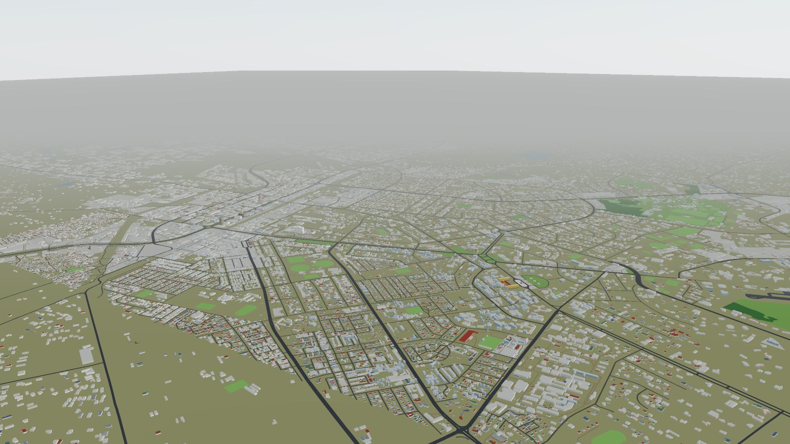

- **The whole city** — 466,000 buildings and 34,000 roads across about
  37 × 31 km, from Matero to Kabulonga to the airport, streamed in as you move.
- **Hand-built landmarks** — modelled from reference photos and measured
  against the map; every part is tagged by how sure we are of it.
- **Get around your way** — Map, Fly (drone) and Walk (street level, with
  walls you cannot walk through) modes; double-click anywhere to go there.
- **Morning to dusk** — a time-of-day slider; windows and lamps light up at night.
- **Runs anywhere** — plain HTML and JavaScript, no install, no build step.

## Landmarks

| | |
|---|---|
| 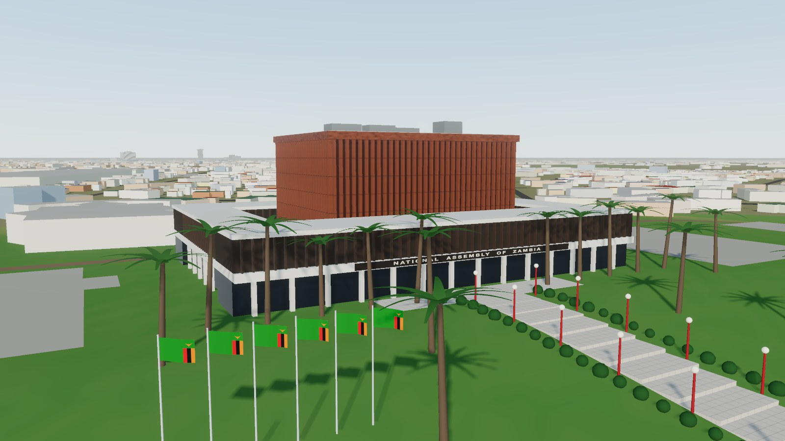 **National Assembly of Zambia** — the copper-finned chamber on its hill, with the approach walkway | 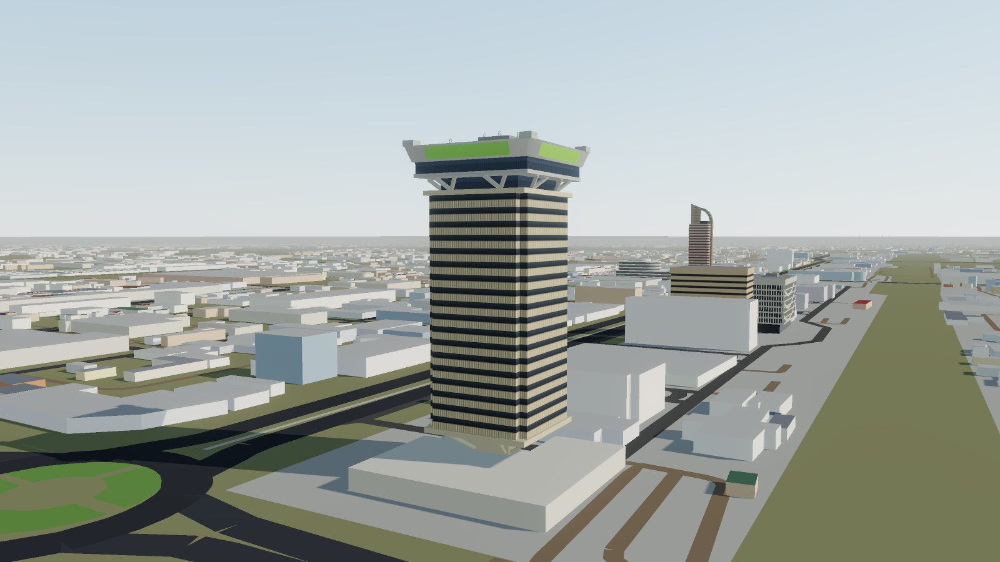 **Findeco House** — Zambia's tallest building, 90 m on Cairo Road |
| 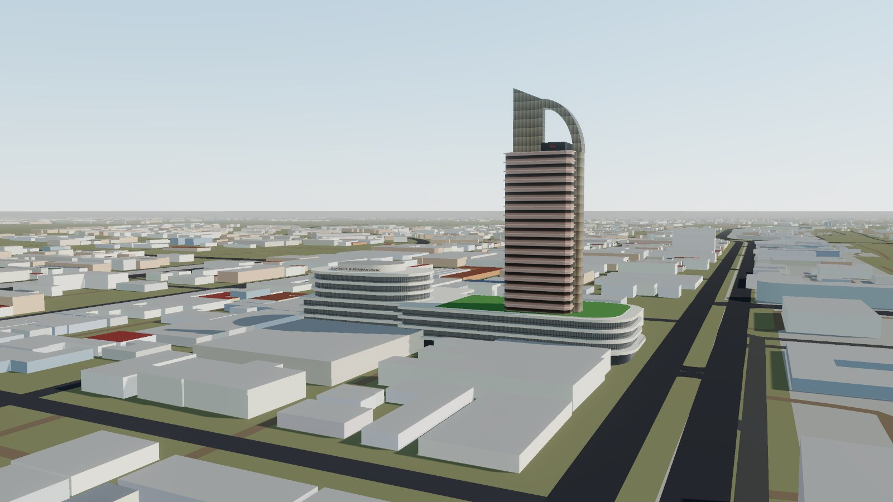 **Society Business Park** — the mall with the Hilton Garden Inn tower on its roof | 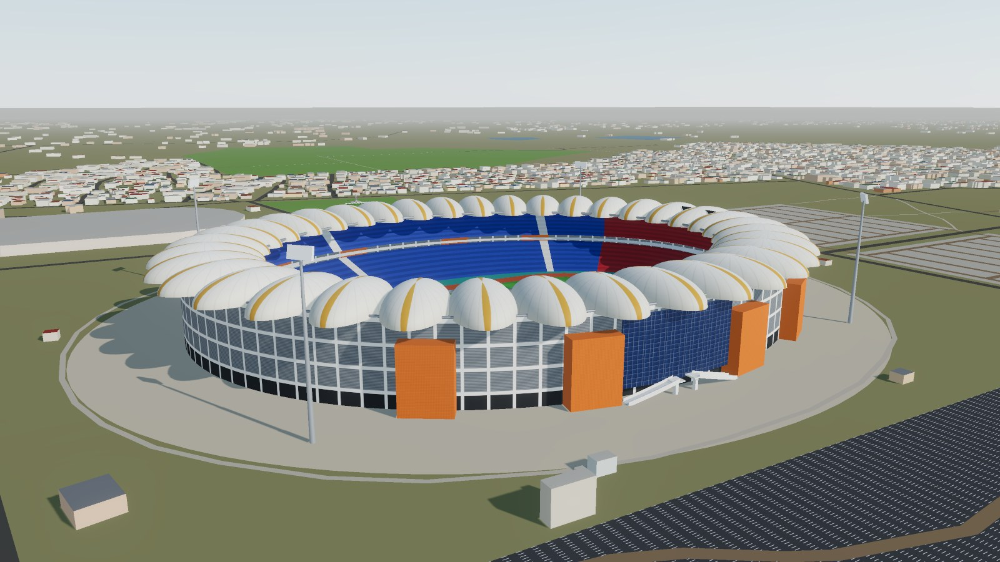 **National Heroes Stadium** — the petal roof, with the Gabon Disaster Memorial nearby |
| 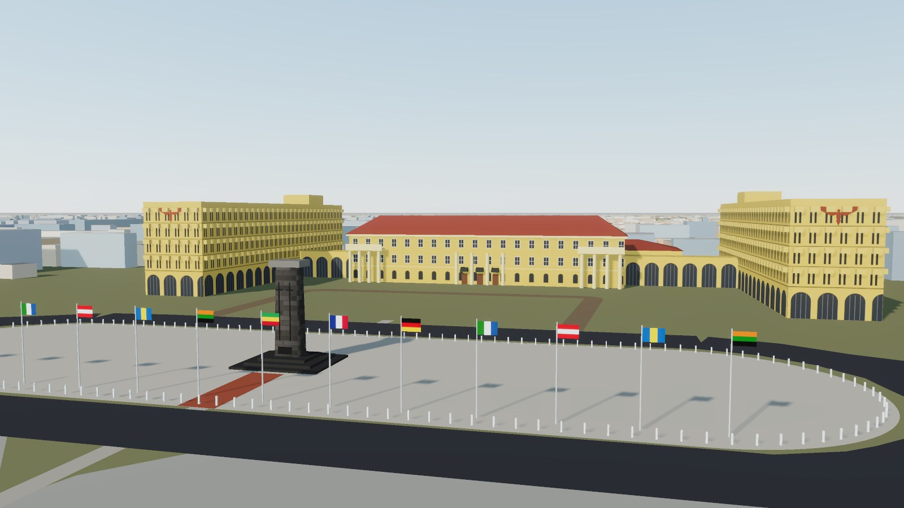 **Cabinet Office** — the colonial block, its two eagle-crested slabs and the Cenotaph square | 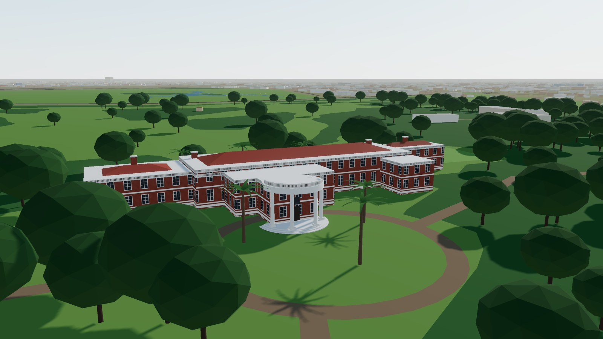 **State House** — the curved portico and its wooded grounds |
| 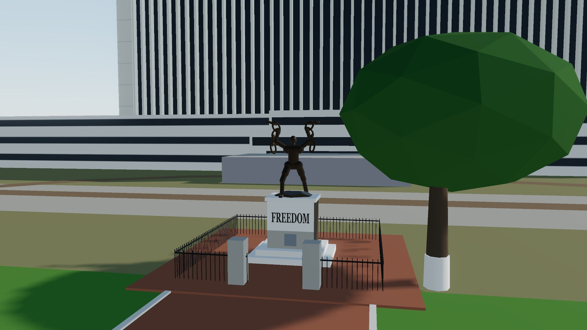 **Freedom Statue** — breaking the chains on Independence Avenue | 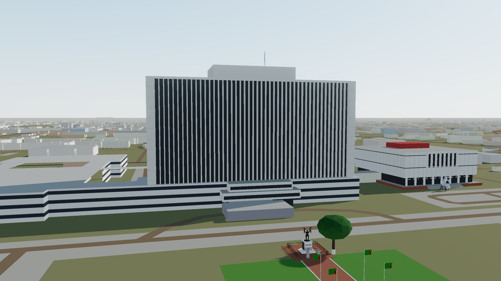 **Government Complex** — the finned slab behind the Freedom Statue |
| 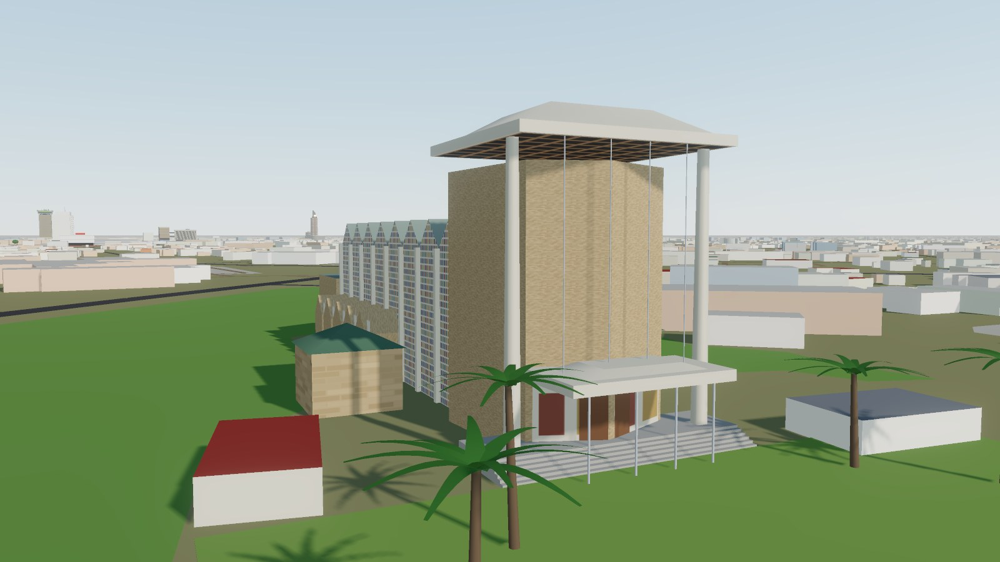 **Cathedral of the Holy Cross** — the prow tower and folded-plate nave | 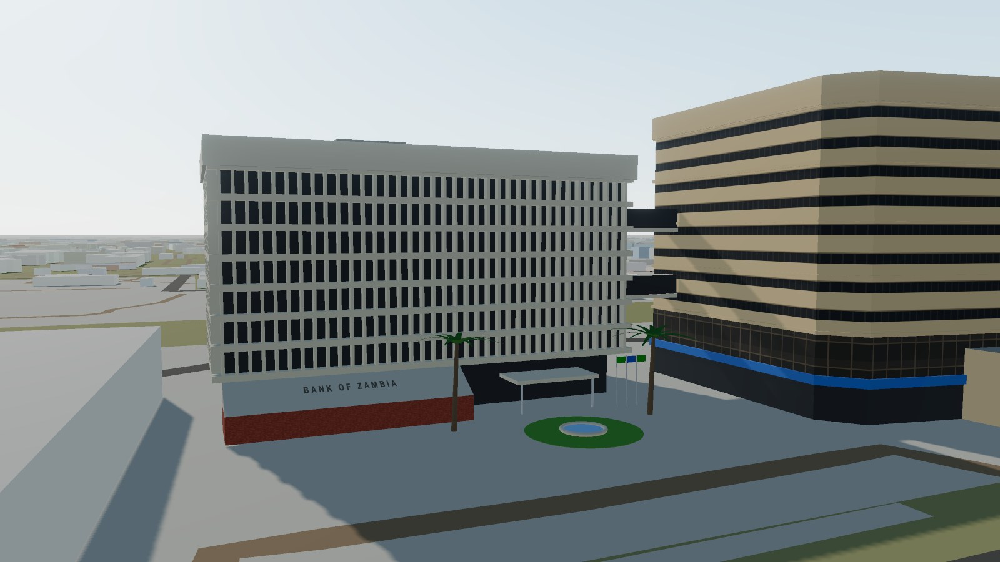 **Bank of Zambia** — the head office and its skybridges |
| 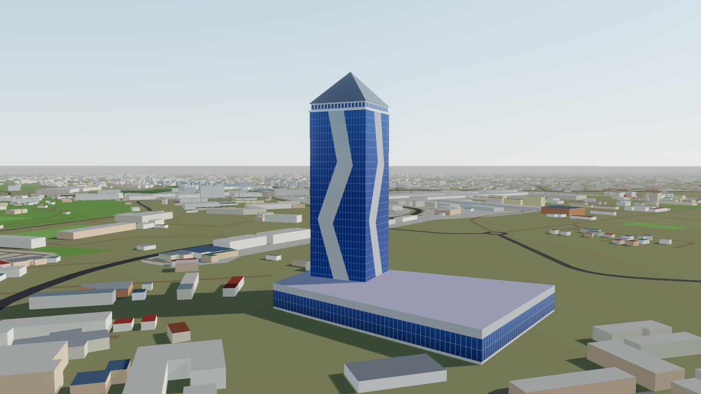 **Pyramid Tower** — "Burj Kalingalinga", Zambia's new tallest building on Thabo Mbeki Road | 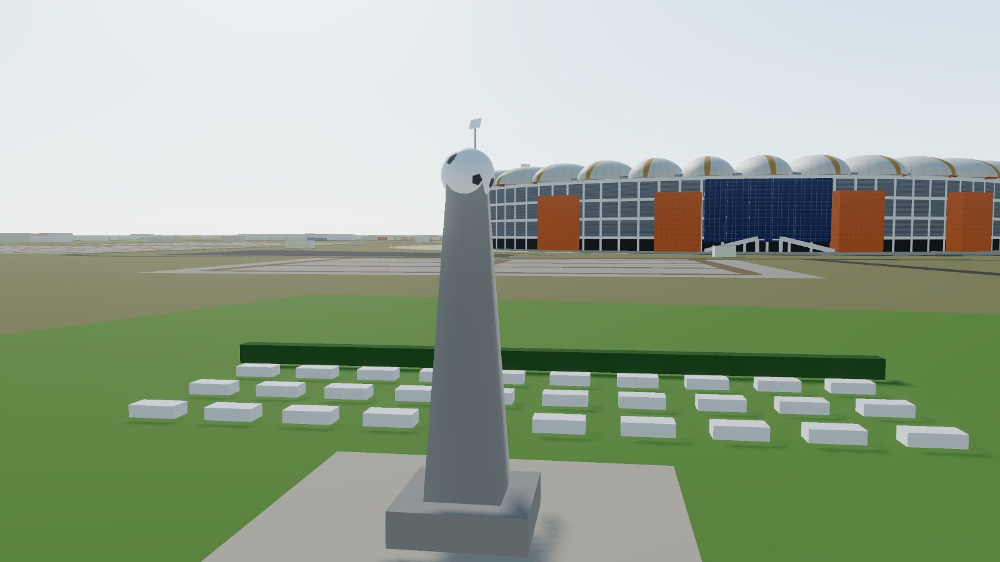 **Gabon Disaster Memorial** — for the 1993 national team, beside Heroes Stadium |
| 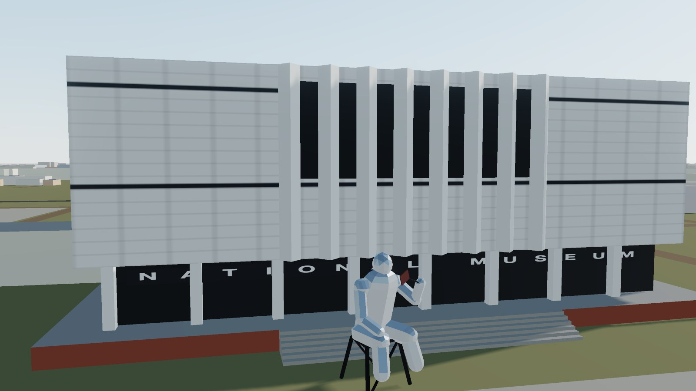 **Lusaka National Museum** — with the steel figure out front | 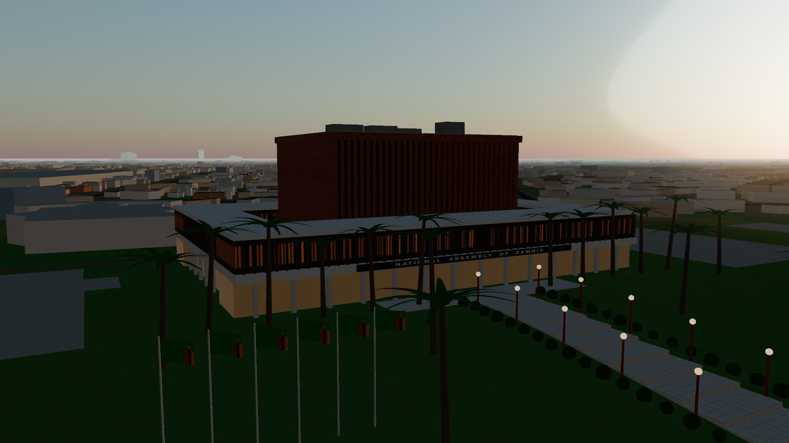 **At dusk** — lamps and windows come on |
| 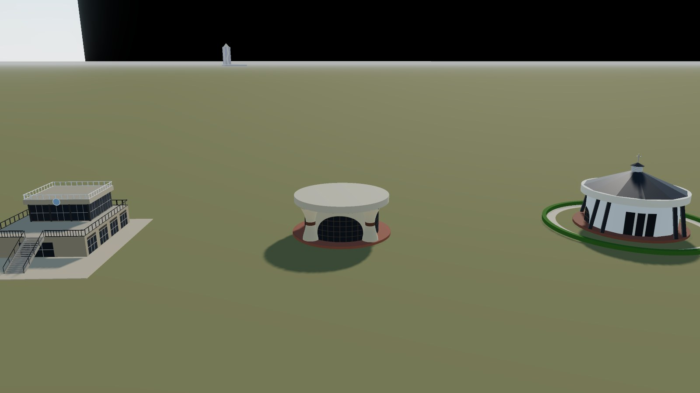 **Embassy Park** — the Sata, Mwanawasa and Chiluba mausoleums | 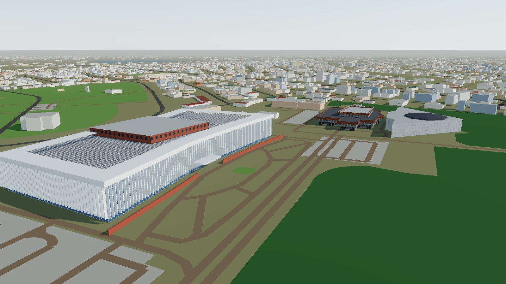 **Mulungushi Conference Centre** — the Kenneth Kaunda Wing, with the 1970 Old Wing and the East Wing behind |
| 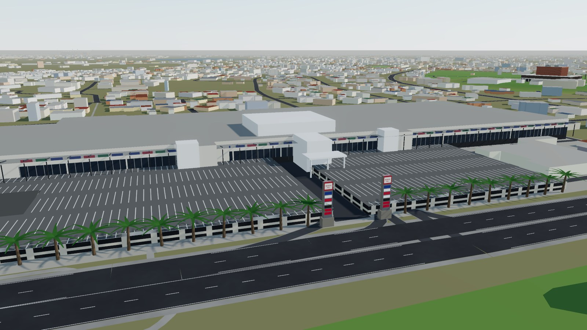 **Manda Hill Mall** — Zambia's first mall, with its parking decks on Great East Road | |

Each landmark has reference notes in [`docs/landmarks/`](docs/landmarks)
saying what it was built from and which parts are measured, estimated or
guessed. Open any of them directly by name, e.g.
[`#findeco-house`](https://lusaka3d.oapps.dev/#findeco-house) or
[`#state-house`](https://lusaka3d.oapps.dev/#state-house).

**What's next:** East Park, Levy Junction and more —
see the [landmark list](docs/LANDMARKS.md) and the
[development planner](docs/DEVELOPMENT_PLANNER.md).

## Help build it

Know Lusaka? The single most useful thing is **photos** of a landmark from
several sides — they turn guesses into accurate models. Code, fixes and new
landmarks are welcome too. Start with **[CONTRIBUTING.md](CONTRIBUTING.md)**.

## Run it locally

```bash
git clone https://github.com/cozyCodr/lusaka-3d.git
cd lusaka-3d
python3 tools/serve.py
```

Open http://localhost:5199 (add `#still` to skip the intro flyover). Press
`?` in the app for the controls.

Styles are prebuilt with Tailwind into `styles/app.css`; after changing class
names in `index.html` or `src/`, run `npm install && npm run build:css`.

## How it works

1. **The city** comes from the OpenStreetMap Zambia extract, cut by
   [`tools/osm_tiles.py`](tools/osm_tiles.py) into 1,330 tiles of 1 km at two
   levels of detail. Tiles near the camera load in full, further out a light
   version, and web workers build the geometry so the page never stalls.
2. **Landmarks** are three.js models in [`src/landmarks/`](src/landmarks),
   placed on their OpenStreetMap outlines and built from reference photos.
   The tiler skips their OSM footprints so nothing is drawn twice.
3. **Confidence** — turn on *Layers → Confidence view* to see which parts are
   measured or photographed (green), estimated (amber) or guessed (red).

Rebuild the tiles from a fresh extract (~250 MB download):

```bash
curl -L -o data/raw/zambia-latest.osm.pbf https://download.geofabrik.de/africa/zambia-latest.osm.pbf
pip install osmium
python3 tools/osm_tiles.py data/raw/zambia-latest.osm.pbf data/tiles
```

The site is static and deployed on Vercel; every push to `main` goes live.

## Licence

- **Code, landmark models and tools:** [PolyForm Noncommercial 1.0.0](LICENSE.md)
  — free to use, change and share for any non-commercial purpose. For
  commercial use, [open an issue](https://github.com/cozyCodr/lusaka-3d/issues)
  to ask for permission. (This makes the project *source-available*, not
  OSI "open source".)
- **City data** in `data/tiles/`: derived from OpenStreetMap,
  © [OpenStreetMap contributors](https://www.openstreetmap.org/copyright),
  under the [ODbL](https://opendatacommons.org/licenses/odbl/) — see
  [`data/tiles/README.md`](data/tiles/README.md). Screenshots of the city are
  produced works of that data and carry the same credit.
